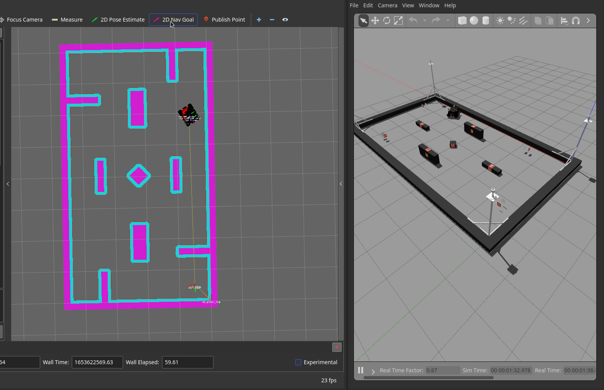
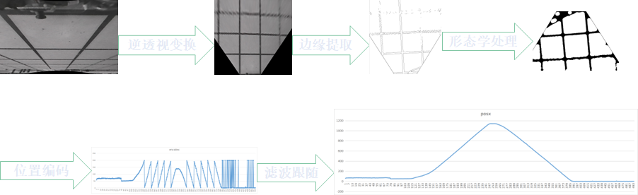
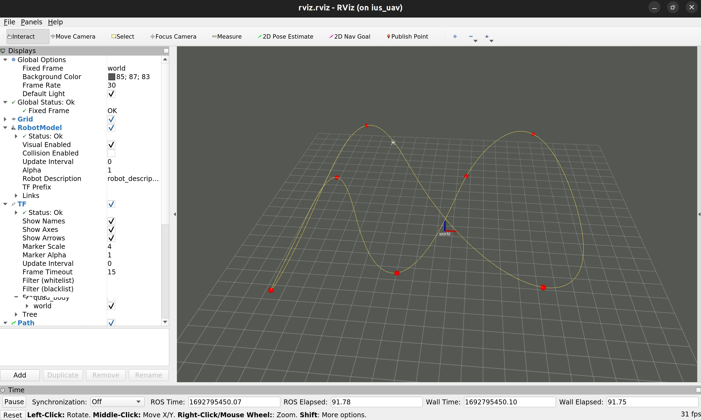
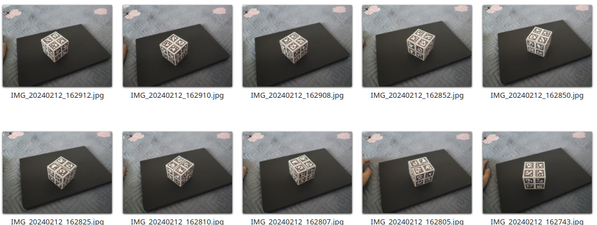
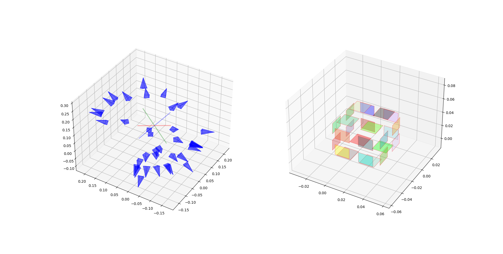

# Project Summary

Author： Xinwei Zhao ([zhaoxinwei74@gmail.com](zhaoxinwei74@gmail.com))

## 0. 大疆RoboMaster无人智能挑战赛

在这个项目中，我们实现了两台机器人的自主导航、自动寻敌、自动瞄准开火等功能，导航部分基于AMCL以及ROS Navigation技术栈，识别部分使用了YOLOV5模型，并使用TensorRT部署在边缘设备。

我完成了系统的仿真、定位、导航和部分图像识别、硬件调试工作。项目的仿真基于Gazebo完成，仿真部分开源供参考。https://github.com/XDUZero2Hero/zero2hero_rmua2022_simulation

## 1.单目相机建图导航

此项目使用单目相机检测路面的车道线，并通过逆透视变换转换成3d点云，使用点云匹配实现简单的里程计

## 2. 视觉定位的自动导引车辆

本项目从零实现了一个装配有4自由度机械臂的物流小车，实现了基于地面特征的视觉定位以及全向底盘、机械臂的轨迹规划控制，可以自主实现物料的抓取和摆放。

我完成了其中规划控制算法、视觉定位算法以及电气设计。

## 3. 使用物理属性的智能分类垃圾桶

几乎所有的垃圾分类都是通过使用图像分类来完成的，但这种方法无法完全描述一个垃圾。我们的系统尽可能多地使用内在属性，如重量、密度、磁感应率、含水量和硬度，来判断垃圾的类别，从而提高准确性。

我们团队（三人）设计了多种传感器检测垃圾的重量、密度、颜色、磁感应率等，并使用KNN算法实现了垃圾的自动分类。

我完成了其中的传感器设计、机械设计以及算法开发。

## 4. 无人机非线性动力学最速曲线优化

复现了 https://github.com/ZhouZiyuBIT/Fast-fly 代码，相比原实现，提供了更合理的初值，调整了优化问题的约束以及目标函数，将优化时间降低为原来的20%（4S->0.8s）

## 5. 基于Gtsam完成基于图像的物体惯性参数标定工具包

使用图优化完成了Apriltag相对位姿的标定，通过简单实验求取物体重心位置、惯性张量（TODO）。

